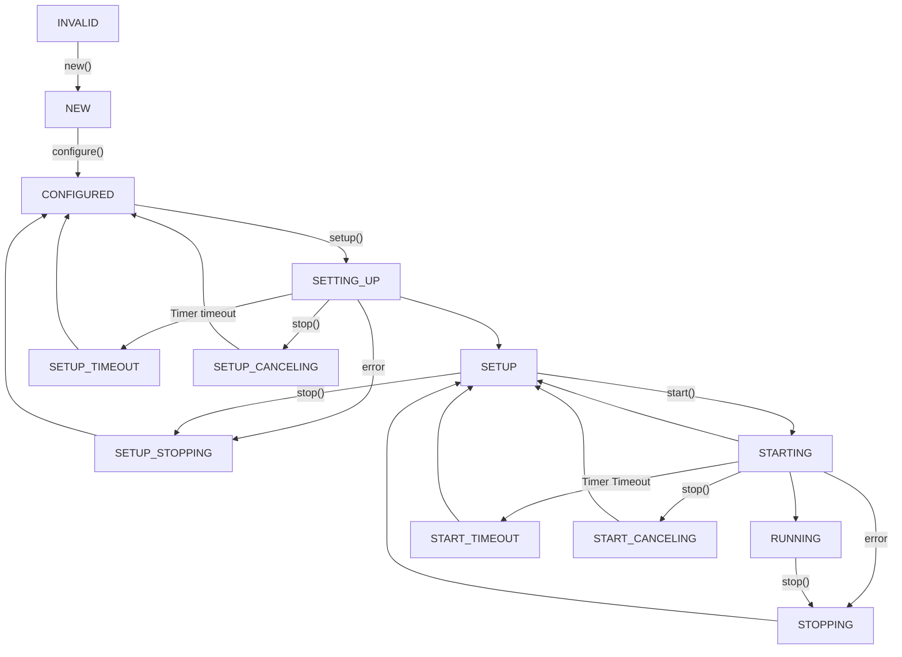

# Link Layer Retry (LLR)

# Table of Contents

- [Link Layer Retry (LLR)](#link-layer-retry-llr)
- [Table of Contents](#table-of-contents)
  - [Overview](#overview)
  - [LLR Functions](#llr-functions)
    - [**Initialization**](#initialization)
    - [**LLR Management**](#llr-management)
    - [**Configuration**](#configuration)
    - [**State Management**](#state-management)
    - [**Utilities**](#utilities)
  - [LLR States](#llr-states)
    - [State Description](#state-description)
    - [State Diagram](#state-diagram)

## Overview

Link Layer Retry (LLR) in Slingshot provides lossless communication for data from the Ethernet LLC/MAC client layer. It is implemented using a **frame-based approach**, which retransmits only the necessary frames during errors. This method allows for faster replay on lightly loaded links and supports both reliable and unreliable frame delivery.

In the standard IEEE layering model, LLR is located between the LLC/MAC client layer and the MAC control layer. Slingshot's LLR ensures proper configuration, setup, and operation of links while handling errors, timeouts, and stop requests gracefully.

---

## LLR Functions

### **Initialization**
- **`sl_llr_init`**
  - Initializes the LLR subsystem by setting up all LLR instances for each device, group, and link.
  - Ensures that each LLR instance is assigned its unique identifiers (`magic`, `version`, `ldev_num`, `lgrp_num`, `link_num`).

---

### **LLR Management**
- **`sl_llr_new`**
  - Creates a new LLR instance for a given link group and link number.
  - **Parameters**:
    - `lgrp`: Pointer to the link group.
    - `llr_num`: Link number.
    - `sysfs_parent`: Parent kobject for sysfs integration.
  - **Returns**: Pointer to the new LLR instance or an error pointer on failure.

- **`sl_llr_del`**
  - Deletes an existing LLR instance.
  - **Parameters**:
    - `llr`: Pointer to the LLR instance.
  - **Returns**: `0` on success or a negative error code on failure.

---

### **Configuration**
- **`sl_llr_config_set`**
  - Configures an LLR instance with the specified configuration.
  - **Parameters**:
    - `llr`: Pointer to the LLR instance.
    - `llr_config`: Pointer to the configuration structure.
  - **Returns**: `0` on success or a negative error code on failure.

- **`sl_llr_policy_set`**
  - Sets the policy for an LLR instance.
  - **Parameters**:
    - `llr`: Pointer to the LLR instance.
    - `llr_policy`: Pointer to the policy structure.
  - **Returns**: `0` on success or a negative error code on failure.

---

### **State Management**
- **`sl_llr_setup`**
  - Sets up an LLR instance for operation.
  - **Parameters**:
    - `llr`: Pointer to the LLR instance.
  - **Returns**: `0` on success or a negative error code on failure.

- **`sl_llr_start`**
  - Starts an LLR instance.
  - **Parameters**:
    - `llr`: Pointer to the LLR instance.
  - **Returns**: `0` on success or a negative error code on failure.

- **`sl_llr_stop`**
  - Stops an LLR instance.
  - **Parameters**:
    - `llr`: Pointer to the LLR instance.
  - **Returns**: `0` on success or a negative error code on failure.

- **`sl_llr_state_get`**
  - Retrieves the current state of an LLR instance.
  - **Parameters**:
    - `llr`: Pointer to the LLR instance.
    - `state`: Pointer to store the retrieved state.
  - **Returns**: `0` on success or a negative error code on failure.

---

### **Utilities**
- **`sl_llr_state_str`**
  - Converts an LLR state to a human-readable string.
  - **Parameters**:
    - `state`: The LLR state to convert.
  - **Returns**: A string representation of the state.

- **`sl_llr_link_dn_behavior_str`**
  - Converts a link-down behavior to a human-readable string.
  - **Parameters**:
    - `behavior`: The link-down behavior to convert.
  - **Returns**: A string representation of the behavior.

---

## LLR States

### State Description

The LLR module operates through a series of well-defined states, each representing a specific stage in the lifecycle of a link. Below is a description of the states:

| **State**                          | **Description**                                                                 |
|------------------------------------|---------------------------------------------------------------------------------|
| `SL_LLR_STATE_OFF`                 | The LLR is off and not configured.                                             |
| `SL_LLR_STATE_CONFIGURED`          | The LLR is configured but not yet set up.                                       |
| `SL_LLR_STATE_SETUP_BUSY`          | The LLR is in the process of being set up.                                      |
| `SL_LLR_STATE_SETUP`               | The setup process is complete.                                                 |
| `SL_LLR_STATE_START_BUSY`          | The LLR is in the process of starting.                                          |
| `SL_LLR_STATE_RUNNING`             | The LLR is running.                                                            |
| `SL_LLR_STATE_CANCELING`           | The LLR operation is being canceled.                                           |
| `SL_LLR_STATE_STOP_BUSY`           | The LLR is in the process of stopping.                                         |

---

### State Diagram

Below is the state diagram for the LLR module, illustrating the transitions between states:

